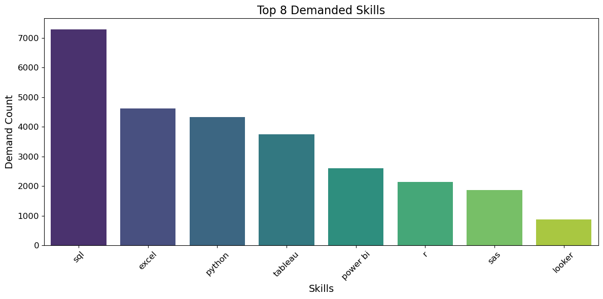

# Introduction 
Welcome to the Top Paying Jobs & In-Demand Skills in Data Analytics project! 🚀 This repository dives deep into the intersection of high-demand skills and high salaries in the data analytics field. 💡

🌟 Project Highlights
Top Paying Jobs: Discover the highest paying roles in data analytics and what makes them so lucrative. 💰
In-Demand Skills: Learn about the skills that are driving the industry forward and commanding top salaries. 📈
Data Insights: Analyze trends and patterns to understand where high demand meets high salary. 🔍
Join us on this journey to uncover the secrets of success in data analytics! 🌐

🔍 SQL queries? check them out here: [project_sql](/project_sql/) 

# Background 
Hello! 👋 I'm a novice SQL programmer embarking on an exciting journey to develop my skills in data analytics. This project, Top Paying Jobs & In-Demand Skills in Data Analytics, serves as a hands-on learning experience for me. Through this project, I aim to:

Enhance My SQL Skills: By working with real-world data, I hope to improve my proficiency in SQL and data manipulation.
Understand Industry Trends: Gain insights into the top paying jobs and in-demand skills in the data analytics field.
Build Analytical Expertise: Develop my ability to analyze data, identify trends, and draw meaningful conclusions.
Join me as I explore the fascinating world of data analytics and strive to bridge the gap between high demand and high salary in this dynamic field! 🌟

# Questiosn I wanted to answer through my SQL queries were: 
    1. What are the top-paying data analyst jobs?
    2. What skills are required for these top-paying jobs?
    3. What skills are most in demand for data analysts?
    4. Which skills are associated wiht higher salaries?
    5. What are the most optimal skills to learn?


# Tools I used 
To achieve these goals, I am utilizing the following tools:

- **SQL**: For querying and managing data.

- **PostgreSQL**: With my own database for data storage and management.

- **Visual Studio Code**: As my primary code editor.

- **Git & GitHub**: For version control and collaboration.
Join me as I explore the fascinating world of data analytics and strive to bridge the gap between high demand and high salary in this dynamic field! 🌟

# The Analysis 📊

**1. Top Paying Data Analyst Jobs**

To identify the highest-paying roles, I filtered data analyst positions by average yearly salary and location, focusing on remote jobs. This query highlights the high-paying opportunities in the field.

```SQL
SELECT
    job_id,
    name as company_name,
    job_title_short,
    job_location,
    job_schedule_type,
    salary_year_avg,
    job_posted_date

FROM    
    job_postings_fact

LEFT JOIN company_dim ON job_postings_fact.company_id = company_dim.company_id

WHERE
    job_title_short = 'Data Analyst' AND job_location = 'Anywhere' AND salary_year_avg is NOT NULL

ORDER BY
    salary_year_avg DESC

LIMIT 10;
```
Here's the breakdown of top data analyst jobs in 2023: 
- **Wide Salary Range**: Top 10 paying data analyst roles span from \$184,000 to \$650,000, indicating significant salary potential in the field.
- **Diverse Employers**: Companies like SmartAsset, Meta, and AT&T are among those offering high salaries, showing a broad interest across different industries.
- **Job Title Variety**: There's a high diversity in analytics roles, reflecting varied specializations within data analytics.

The skill frequency analysis for top paying data analyst roles in 2023 highlights that **SQL** and **Python** are the most in-demand skills, followed by **Tableau** and **R**. These skills are essential for roles such as Director and Analyst, emphasizing the importance of data manipulation, statistical analysis, and data visualization in high-paying positions.


*Bar graph visualizing the salary for the top salaries for data analysts*

**2. Skills for Top Paying Jobs**

To understand what skills are required for the top-paying jobs, I joined the job postings with the skills data, providing insights into what employers value for high-compensation roles.

```sql 
WITH top_paying_jobs AS (
    SELECT
        job_id,
        job_title,
        salary_year_avg,
        name as company_name
    FROM    
        job_postings_fact

    LEFT JOIN company_dim ON job_postings_fact.company_id = company_dim.company_id

    WHERE
        job_title_short = 'Data Analyst' AND job_location = 'Anywhere' AND salary_year_avg is NOT NULL
    
    ORDER BY
        salary_year_avg DESC

    LIMIT 10
)

SELECT 
    top_paying_jobs.*,
    skills

FROM top_paying_jobs
INNER JOIN skills_job_dim ON top_paying_jobs.job_id = skills_job_dim.job_id
INNER JOIN skills_dim ON skills_job_dim.skill_id = skills_dim.skill_id
ORDER BY 
    salary_year_avg DESC
```



*This charts displays the top 8 skills that were demanded from job postings for data analysts*


**3. In-Demand Skills for Data Analysts**

This query helped identify the skills most frequently requested in job postings, directing focus to areas with high demand.

```sql 
SELECT 
    skills,
    COUNT(skills_job_dim.job_id) AS demand_count
FROM job_postings_fact
INNER JOIN skills_job_dim ON job_postings_fact.job_id = skills_job_dim.job_id
INNER JOIN skills_dim ON skills_job_dim.skill_id = skills_dim.skill_id
WHERE
    job_title_short = 'Data Analyst' AND job_work_from_home = 'True'
GROUP BY
    skills
ORDER BY 
    demand_count DESC
LIMIT 5
```

Here's the breakdown of the most demanded skills for data analysts in 2023:
- **SQL** & **Excel** remain fundamental, emphasizing the need for strong foundational skills in data processing and spreadsheet manipulation.
- **Programming** and **Visualization tools** like **Python**, **Tableau**, and **Power BI** are essential, pointing towards the increasing importance of technical skills in data storytelling and decision support.

Here is the data in a table format:

| **Skills**   | **Demand Count** |
|--------------|------------------|
| SQL          | 7291             |
| Excel        | 4611             |
| Python       | 4330             |
| Tableau      | 3745             |
| Power BI     | 2609             |

*Table for the demand for the top 5 skills in data analyst job postings*

**4. Skills based on Salary**

Top Paying Skills:

Here is a table of the top 5 paying skills for data analysts based on the data you provided:

| **Skill**       | **Average Salary** |
|-----------------|--------------------|
| PySpark         | \$208,172          |
| Bitbucket       | \$189,155          |
| Couchbase       | \$160,515          |
| Watson          | \$160,515          |
| DataRobot       | \$155,486          |

Here are the key trends:

- **Big Data** and **Machine Learning**: Skills like **PySpark**, **DataRobot**, and **Watson** are highly valued, reflecting the growing importance of big data and machine learning in data analysis.
- **Version Control Systems**: **Bitbucket** and **GitLab** are among the top-paying skills, indicating the importance of version control in managing data projects.
- **Data Management and Analysis Tools**: Tools like **Couchbase**, **Jupyter**, **Pandas**, and **Elasticsearch** are crucial for data storage, management, and analysis, leading to higher salaries for professionals proficient in these tools.
- **Programming Languages**: **Swift**, **Golang**, and **Scala** are among the top-paying skills, highlighting the demand for programming expertise in data analysis.
- **Cloud and DevOps**: Skills like **Kubernetes**, **GCP**, and **Jenkins** are also well-paid, showing the integration of cloud computing and DevOps practices in data analysis workflows.

These trends suggest that data analysts with expertise in big data, machine learning, version control, data management, programming, and cloud/DevOps are in high demand and command higher salaries.

**5. Optimal Skills for Data Analysts**

Combining insights from demand and salary data this query aimed to pinpoint skills that are both in high demand and have high salaries, offering a strategic focus for skills developement.

```sql
SELECT 
    skills_dim.skill_id,
    skills_dim.skills,
    COUNT(skills_job_dim.job_id) AS demand_count,
    ROUND(AVG(job_postings_fact.salary_year_avg), 0) AS avg_salary

FROM
    job_postings_fact
INNER JOIN skills_job_dim ON job_postings_fact.job_id = skills_job_dim.job_id
INNER JOIN skills_dim ON skills_job_dim.skill_id = skills_dim.skill_id

WHERE
    job_title_short = 'Data Analyst'
    AND salary_year_avg IS NOT NULL
    AND job_work_from_home = True

GROUP BY 
    skills_dim.skill_id
HAVING
    COUNT(skills_job_dim.job_id) > 10

ORDER BY 
    avg_salary DESC,
    demand_count DESC
LIMIT 25     
```


Here are the top 10 optimal skills along with their average salaries:

Here are the top 10 optimal skills for data analysts along with their average salaries and demand counts:

| **Skill**       | **Average Salary** | **Demand Count** |
|-----------------|--------------------|------------------|
| **Go**          | **\$115,320**      | **27**           |
| **Confluence**  | **\$114,210**      | **11**           |
| **Hadoop**      | **\$113,193**      | **22**           |
| **Snowflake**   | **\$112,948**      | **37**           |
| **Azure**       | **\$111,225**      | **34**           |
| **BigQuery**    | **\$109,654**      | **13**           |
| **AWS**         | **\$108,317**      | **32**           |
| **Java**        | **\$106,906**      | **17**           |
| **SSIS**        | **\$106,683**      | **12**           |
| **Jira**        | **\$104,918**      | **20**           |
*Table of the most optimal skills for data analyst sorted by salary*

Here's a breakdown of the most optimal skills for Data Analysts in 2023:
1. **Highest Paying Skill**: The skill **"Go"** tops the list with an average salary of **\$115,320**.
2. **Cloud Platforms and Big Data**: Skills related to cloud platforms and big data technologies, such as **"Snowflake," "Azure," "BigQuery," and "AWS,"** are highly valued and among the top 10.
3. **Programming Languages**: Traditional programming languages like **"Java"** continue to be in high demand with competitive salaries.
4. **Project Management and Collaboration Tools**: Tools like **"Confluence"** and **"Jira"** are also highly valued, reflecting the importance of project management and collaboration in the workplace.
5. **Data Visualization and Business Intelligence**: Skills like **"Looker"** (though not in the top 10, it is close) indicate a strong demand for data visualization and business intelligence tools.

These trends highlight the growing importance of **cloud computing, big data, and project management skills** in the job market.

# What I Learned 📚✨
In this analysis, I delved into various aspects of SQL querying and data analysis, which enhanced my understanding of several advanced concepts:

- 🧠 Complex Querying: Constructing complex SQL queries to extract meaningful insights.
- 🛠️ Advanced SQL Techniques: Using WITH clauses and temporary tables for manageable queries.
- 🔗 Types of Joins: Combining data from multiple tables using INNER JOIN and LEFT JOIN.
- 🧩 Logical Operations: Applying logical operations for precise filtering and data manipulation.
- 📊 Data Aggregation: Summarizing and organizing data with GROUP BY and ORDER BY.
- 📈 Aggregate Functions: Calculating occurrences and averages with COUNT() and AVG().

# Conclusion 🎉
This project has significantly advanced my SQL skills by using PostgreSQL server in combination with VS Code. It has provided me with practical experience in analyzing real-world data, such as identifying top-paying and in-demand skills for data analysts. This hands-on approach has made me more confident in my abilities and will serve as a stepping stone in my career and skill set. 🚀✨
